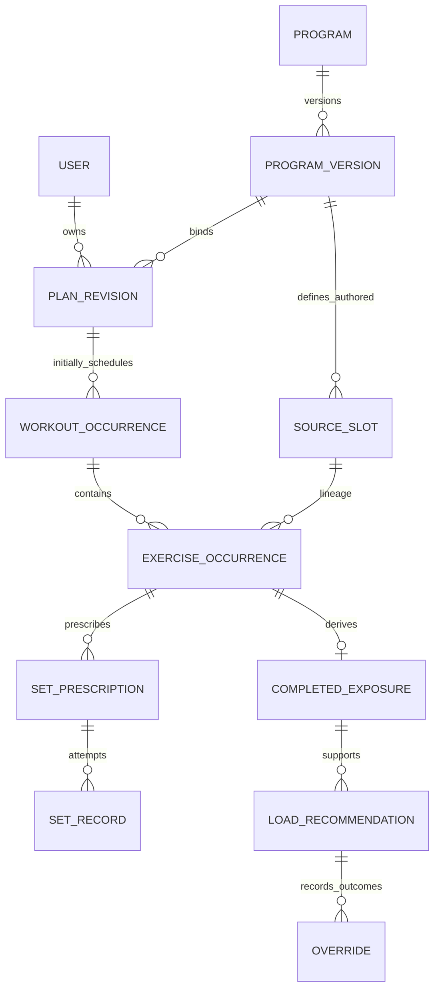

# Domain vocabulary and lifecycle

Status: **Proposed terminology**, preserving owner-approved mode/load/date boundaries. [ADR-005](../adr/0005-training-history-identity-and-correction.md) and [ADR-006](../adr/0006-load-and-exposure-model.md) govern proposed identities. This model is not a migrated schema.

| Term | Meaning and lifecycle |
|---|---|
| Authored Program | Source-controlled program identity; Phase 1 and Phase 2 are separate. Execution does not grant design authority. |
| Customized Program | Original deterministic design under explicit consent/constraints, with an independent lifecycle; not a source layout replay. |
| Program Version | Immutable source/design version with hashes and rules/schema provenance. One program has many versions. |
| Source Exercise Slot | A particular authored occurrence within source week/session/order. Same exercise in two slots remains two identities. Defined source choices/relationships belong here. |
| Plan Revision | User-specific immutable prescription/configuration snapshot bound to program version, consent/profile/rules and selected-date input. New planning creates a successor; completed work is not rewritten. |
| Scheduled Workout Occurrence | One user-specific execution opportunity with stable identity and placement history. Initially references a plan revision; later revisions explicitly retain/move/replace it. |
| Exercise Occurrence | Ordered instance inside a workout, bound to its source slot when authored. Equal exercise catalog IDs never imply equal occurrences. |
| Set Prescription | Particular required working set or typed technique child/warm-up with reps, effort, rest and source instruction. Ordinal/child relationship is scoped to an exercise occurrence. |
| Set Record / Event | Actual submitted attempt, with stable command/logical-set identity, performed load/reps/effort and timestamps. “Event” does not mandate global event sourcing. Corrections/voids preserve original and effective state. |
| Completed Exercise Exposure | Finalized exercise occurrence with all required effective qualifying working sets; carries completeness/comparability and rule version. Explicitly partial closure is recorded, not silently counted as a completed comparable exposure. |
| Performed Exercise Variant | Confirmed exercise/equipment/load configuration actually performed. Authored slot remains original; variant and approval are recorded separately. |
| Load Recommendation | Versioned next/current-exposure increase/hold/decrease/monitor decision with supporting effective records, feasible load, sufficiency and scope. |
| Recommendation Override | User accepted/declined/modified outcome, actual chosen value/reason and time. Automatic prefill is not manufactured explicit acceptance. |
| Readiness Observation | Dated self-report such as sleep, energy, soreness or pain, with provenance and uncertainty; not causal proof or automatic authored dose authority. |
| Equipment / Gym Profile | User-owned versioned inventory of equipment, load bases/units and attainable increments; one user can eventually have many. |
| Selected Training Date | Distinct local calendar date within selected local week and IANA timezone, explicitly chosen by the user. Different from UTC completion time or current day count. |
| Decision Trace | Versioned inputs/context, rule/permissions, evidence, result/conflicts and reason codes sufficient for replay, without secret/personal-data publication. |

The diagram shows the authored lineage and initial assignment only. Customized occurrences need no authored slot; relationship/link rows may be required for preserved occurrences across revisions or redistributed units. A source slot can recur across user plans while retaining its source identity; an exercise occurrence cannot be identified by exercise ID alone. One finalized occurrence has one current derived summary, which can be revised after correction. Recommendations can use multiple summaries through evidence links; repeated same-workout occurrences are not assumed statistically independent observations.

Lifecycle: planned → started → completed or explicitly closed-partial/cancelled. Starting freezes the execution prescription; rescheduling changes placement through a revision without altering completed data. A replacement occurrence is linked rather than silently reusing old identity. Void/correction changes effective records and invalidates/reconstructs affected projections/advice. Ambiguous legacy strings remain legacy/unknown until evidence supports mapping.

Constraints and units are specified in [data model](data-model.md), [execution](../contracts/execution-plan.md), [load](../contracts/load-progression.md) and [dates](../contracts/selected-date-scheduling.md). Exact persistence/lifecycle exceptions remain review decisions.
