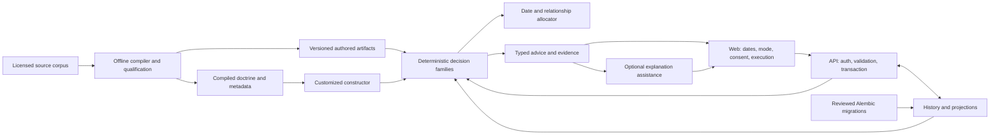

# Target system architecture

Status: **Proposed technical architecture**, based on owner-approved product direction and the explicit 2026-09-28 deterministic prescription boundary. This is a target, not the deployed system. [Current state](current-state.md) is scoped to the audited revision; [ADR index](../adr/README.md) controls proposed choices. Preserve useful components through incremental vertical changes; no rewrite or global event store is required.

## Components and ownership

| Component | Target responsibility | Preserve / evolve |
|---|---|---|
| Next.js web | Weekly date selection, mode/consent, faithful runner, effort capture, load prefill/override and recommendation explanations. | Preserve existing routes; remove duplicated policy calculations by consuming typed decisions. UI cannot grant itself mode authority. |
| FastAPI orchestration | Authenticate/authorize, validate/version commands, resolve input snapshots, transact records and return decisions. | Preserve API seams; relocate router-owned training policy to tested decision owners rather than copying it. |
| Deterministic core | Typed mode permissions, exposure/load, readiness, scheduling, review and recommendation decision families. | Preserve `decision_*.py` and façades where they delegate; inject clock, versions and context. No runtime prescription inference from AI. |
| Authored compiler/adapter | Compile licensed sources, diagnose and certify full prescriptions/relationships; bind immutable versions to execution. | Preserve offline ingestion, gold lineage and separate phases; repair AMRAP/set-specific losses. |
| Customized constructor | Normalize `GenerationProfile`, assess constraints, build original independent program lifecycle, expose fallback/infeasibility. | Preserve assessment/blueprint/constructor seams; consolidate bands/repairs to one policy authority. Metadata scoring stays frozen. |
| Scheduling | Allocate source units to actual local dates; scoped recovery/duration feasibility and revisioned placement. | Reuse deterministic allocator seams after identity/fidelity; M2B manual weekly dates needs no external calendar. |
| History/persistence | Effective performed records and retained correction history; immutable prescription lineage; reconstructible state. | Add reliable identities/transactions; SQLAlchemy/PostgreSQL remain viable. JSON can remain where versioned and validated. |
| Recommendations/explanation | Typed action/evidence/permissions, uncertainty and outcomes; optional explanation assistance. | Existing traces/rationale preserved. AI prose cannot write prescriptions or disguise insufficient evidence. |
| Evidence/observability | Decision traces, private diagnostics, criterion-linked manifests and safe operational signals. | Preserve structured correlation; keep secrets and personal records out of published evidence. |
| Database/migrations/deployment | Reviewed Alembic schema authority, runtime least privilege, safe startup, qualified transport/recovery. | Existing Compose/Caddy topology can evolve; effective production controls remain unknown. |

The explanation branch has no prescription-write edge. All application commands recheck permissions and expected revision before applying a deterministic result. Offline source writers and production runtime readers have different ownership; an artifact path is not an authorization bypass.

## Dataflow and release boundaries

Plan creation resolves explicit mode, immutable program/profile/rule versions, selected dates/timezone and observed context. Core decisions return typed decisions/conflicts/traces; orchestration commits a plan revision and occurrence identities. Execution resolves the preserved prescription, confirmed variant and achievable load. A logging command records actual work once, updates/reconstructs projections and exposes advice based on effective history.

Readers must not silently regenerate a completed prescription. Advice, an override and an applied plan revision remain distinct. Customized advisory against an authored snapshot returns a diff without activation; consent is checked again when requesting a mode transition.

SEC-S1 is a separately reviewable API/configuration correction; training history redesign is not its dependency. Auth-version migration, history identities and source changes have separate compatibility/recovery gates. Target module locations and schema/grants are proposals, not a mandate to move all code immediately.

Open choices include explicit legacy consent mapping, history correction storage, started-date/carryover policy and operational session/storage/recovery controls. They are recorded in the [data model](data-model.md), [contracts](../contracts/execution-plan.md) and [roadmap](../roadmap/milestones.md), not assumed from component names.
