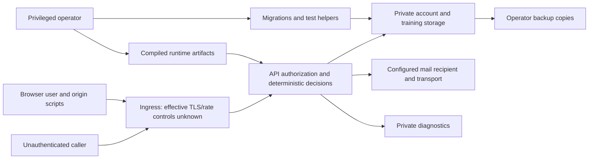

# Repository threat model

Status: **Draft from completed audit evidence**, application revision `df9965232ce731f8234d222acc526a90bc6be620`. No new broad scan, subagent review, production access or runtime probe. This pass sequentially reconciles the supplied source/threat evidence; it is not a new independent review. [Audit provenance](../evidence/README.md#audit-reference-and-migration-plan) retains the original independent architecture analysis. Proposed controls are not qualified controls. [SECURITY.md](../../SECURITY.md) governs private reporting and non-destructive research; no external report is sent.

## Overview

The self-hosted web/API training app stores account and private training/context records, executes deterministic planning and consumes offline-compiled sources. Ordinary users log their own work; unauthenticated callers register/login/request recovery. Operators import sources, deploy images, migrate/back up databases and can run privileged development/test helpers. These capabilities have distinct enforcement; operator authority is not an ordinary remote attacker starting privilege.

| Component/source | Boundary |
|---|---|
| [Auth router](../../apps/api/app/routers/auth.py#L94), [dependency](../../apps/api/app/deps.py#L13) | Public credential issuance/recovery versus protected current-user operations. |
| [Models](../../apps/api/app/models.py#L17), [security](../../apps/api/app/security.py#L20) | Stored password/reset state and JWT authority. |
| [SMTP](../../apps/api/app/emailer.py#L68), [validation](../../apps/api/app/main.py#L49) | Outbound credentials/mail and diagnostics cross separate trust boundaries. |
| [Compose](../../docker-compose.yml), [Caddy](../../infra/caddy/Caddyfile) | Source-defined ingress/service/persistence topology; external TLS unknown. |
| [Test target helper](../../apps/api/test_db.py#L21), [backup](../../infra/scripts/backup_postgres.sh#L5) | Privileged operator/test processes can modify/export configured persistence. |
| [Loader](../../apps/api/app/program_loader.py#L373), [API image](../../apps/api/Dockerfile#L18) | Operator-produced templates/rules/compiled knowledge consumed at runtime. |

| Deployment/workflow | Resource/capability | Configuration/precedence | Safe effective location/state | Readers/writers/recipients | Enforcing control / evidence |
|---|---|---|---|---|---|
| Compose API + migration | Database/data/schema | DATABASE_URL else split settings; Compose Alembic then Uvicorn. | Configured PostgreSQL + postgres_data volume; live identity/grants unknown. | API/migration roles and database operator. | Same resolved URL and startup create_all: [main](../../apps/api/app/main.py#L37), [Alembic](../../apps/api/alembic/env.py#L14). Separation unqualified. |
| Direct API startup | Database/schema | Same settings resolution; no Compose migration wrapper. | Configured DB; create_all still executes. | Local/runtime process. | [Database](../../apps/api/app/database.py#L7), main startup. Compatibility/grants unknown. |
| Public recovery | Reset credential | Exposure flag OR incomplete SMTP; confirmation consumes hash/expiry. | Credential can reach unauthenticated response under source conditions; effective flags unknown. | Requester, selected mailbox, API. | [Auth](../../apps/api/app/routers/auth.py#L126); hashed/expiring sequential consumption is insufficient against disclosed token. |
| Configured SMTP | Mail/login/reset URL | SMTP settings and configured reset-link base; optional TLS. | Configured endpoint/recipient; no secret values reproduced. | SMTP service and intended mailbox/browser. | [Emailer](../../apps/api/app/emailer.py#L68): no verified context; external mail controls unknown. |
| Compose logging | Diagnostic copy | LOG_FILE_PATH default and logs bind mount. | Container logs mapped to repository logs; no log read here. | API, host/stdout readers. | Key-name redaction/rotation; [observability](../../apps/api/app/observability.py#L140), generic validation-input gap. Filesystem access unknown. |
| Direct local logging | Diagnostic copy | Relative log path resolved from API working directory unless overridden. | API-working-directory logs; actual override unknown. | Local process/filesystem readers. | Same logger; deployment path differs, not separate tenant authorization. |
| Browser application | JWT/drafts/session cache | Application localStorage keys and API destination config. | Browser-origin storage; session cache keyed reused workout string. | Browser user/origin scripts. | Browser origin isolation plus server JWT; storage is not server authorization. Audit identifies cache/token consequences, no XSS proven. |
| Destructive test/reset helper | DDL/truncation | Test URL or inherited DB settings; Compose/helper defaults. | Can target ordinary configured persistence absent guard. | Privileged tester/operator. | [test_db](../../apps/api/test_db.py#L21); container freshness does not establish DB isolation. |
| Backup script | Private export | Caller working directory + DB selection. | Caller-relative infra/backups SQL file. | Privileged operator/host readers. | [backup](../../infra/scripts/backup_postgres.sh#L5); complete encryption/restore system unqualified. |
| Runtime artifact image | Source/rules/knowledge | Packaged programs, docs/rules, knowledge/compiled; permitted loader overrides. | Image runtime artifacts / corresponding checkout paths. | Operator compiler writes, API reads. | Loader schema/containment and fixed IDs; raw reference input remains offline. |

## Threat Model, Trust Boundaries, and Assumptions

Assets: account identity/signing/reset capabilities; private onboarding/readiness/measurements and workout history; source/prescription integrity and consent; service/database availability; diagnostic/backup copies and publication evidence. Objectives are ownership isolation, no unauthorized prescription/account mutation, secret confidentiality, stable retry/correction behavior and safe privileged testing/schema operations.

Actors: anonymous network caller controls request email/token/payload without account/operator credentials; ordinary authenticated user controls their own commands and client but not another user’s server identity; active SMTP-path attacker needs network position; log reader needs diagnostic access; compromised browser-origin script needs a separate script compromise; operator controls imports/deployment/database but is not assumed malicious/compromised. Their powers are not interchangeable.

Established controls: server JWT/current-user derivation; user-scoped queries in reviewed routes (no reviewed-path IDOR established); random hashed expiring reset tokens with sequential use marking; default-off development wipe; schema/containment-checked artifact paths; offline compilation and deterministic runtime. Configuration presence does not qualify effective live TLS, grants or abuse controls. No dependency, full source-line, deployed-image or backup coverage is claimed.

Assumptions/open prerequisites: reachable recovery routes, actual exposure/SMTP/key state, effective ingress/origin/rate and TLS controls, log/backup permissions, database grants, exact deployed artifact and key/worker cutover. Assess only through separately authorized sanitized states in the [urgent brief](urgent-account-recovery.md). No live account requests, sessions, logs or data inspection is implied.

## Attack Surface, Mitigations, and Attacker Stories

Source-established findings are labeled; other stories remain conditional hypotheses/operational risks. Existing program correctness defects are not automatically remote security vulnerabilities.

| Priority | Scenario/capability gain | Prerequisites | Impact | Existing controls | Proposed mitigation / evidence |
|---|---|---|---|---|---|
| P0 / source finding | Anonymous email-known requester gets reset token then changes password. | Reachable recovery; exposure enabled OR incomplete SMTP. | Account takeover; live occurrence unknown. | Hashed/expiry check does not prevent using disclosed credential. | S1 no credential response and qualified delivery; auth lines 94/126. |
| P0 / conditional source finding | Attacker signs a JWT using retained known placeholder key. | Actual weak/default signing key. | Impersonation. | Algorithm pinning alone insufficient. | Validated provisioned key/approved cutover; [security](../../apps/api/app/security.py#L20), [config](../../apps/api/app/config.py). |
| P0 / source finding | Holder of previously stolen JWT continues after password reset. | Prior token possession and unexpired token. | Recovery fails to terminate prior access. | JWT expiration; password changes do not revoke it. | Atomic version revocation S2; deps line 13/auth reset. |
| P0 / conditional source finding | Active mail-path attacker impersonates SMTP recipient/server. | SMTP configured and attacker position. | Reset mail/SMTP credential interception. | SMTP login/TLS request; certificate authentication absent. | Verified TLS/no fallback; emailer line 68. |
| P0 / operational risk | Authorized test helper accidentally destroys live persistence. | Privileged execution with inherited ordinary DB target. | Production data loss; no remote privilege gain claimed. | Host/Docker access requirement. | Explicit disposable target guards and restore evidence; test_db line 21. |
| P0 / availability hypothesis | Recovery flood consumes CPU/mail/account supersession budget. | Reachable route; effective edge limits absent/bypassable. | Service/email disruption. | External limits unknown; expensive digest evident. | All-ingress budgets before hashing/delivery; capacity test. |
| P1 / source finding | Diagnostic reader obtains rejected credential material. | Invalid secret input plus log access. | Credential disclosure. | Key-name redaction insufficient for generic values. | Allowlisted private diagnostics; main line 49/observability line 140. |
| P1 / conditional hypothesis | Origin-script compromise steals localStorage JWT; unchecked next redirects aid phishing. | Separate script compromise or crafted navigation. | Token misuse/phishing; no XSS/token leak proven. | Browser origin boundary/JWT checking; framework blocks javascript URL case noted in audit. | Session/redirect/origin ADR and browser qualification; no cookie migration mandated here. |
| P1 / conditional privileged surface | Development email-targeted wipe deletes another account when flag enabled. | Flag enabled plus reachable endpoint. | Account/data destruction. | Default false and confirmation; self-wipe additionally authenticates. | Verify disabled state; [auth](../../apps/api/app/routers/auth.py#L66). Not unconditionally exposed. |
| P1 / operational hypothesis | Schema startup, backup copy or broad image input violates data/confidentiality boundary. | Runtime DDL grants, weak file/image access or unsafe operator workflow. | Availability/private-data exposure. | Operator authority; image/grants/filesystem controls unknown. | Migration-only authority, positive input boundaries, private manifests/restore; ADR-009. |
| P1 / integrity risk | Cross-week ID/retry/undo errors contaminate recommendations. | Ordinary execution/retries; reused occurrence strings. | Wrong progress/load advice; no new cross-account exploit established. | User-scoped ORM queries in inspected paths. | Occurrence/command identity and reconstruction; ADR-005. |
| P1 / supply/authority hypothesis | Unreviewed compiler/artifact update changes authored prescription or generated permissions. | Privileged artifact writer/compromised build workflow. | Source fidelity and consent violation. | Offline boundaries, schema/path checks; no evidence of attacker-controlled writer. | Version hashes/licensed parity/permission tests; ADR-002/003. |

## Severity Calibration (Critical, High, Medium, Low)

Critical would require established broad administrative compromise or mass arbitrary data/host access with reachable prerequisites; none is established here. A mere default declaration or privileged operator already controlling a DB is not Critical.

High fits the independently source-validated anonymous reset-credential takeover when route/configuration prerequisites hold. Production applicability remains unknown. Destructive tooling is a high operational risk, separately labeled, not an anonymous API exploit.

Medium fits known-default JWT forgery if retained, old stolen-token persistence, and SMTP impersonation under active-path prerequisites. A validated key/transport or unreachable endpoint materially changes exposure; do not invent those mitigations.

Low fits log-reader-dependent credential leakage and open-redirect/phishing in the scoped audit; larger established credential impact could warrant recalibration. Ordinary authorized self-action, a hypothetical XSS with no source finding, or internal names matching a keyword do not establish a vulnerability. Impact, confidence and missing live prerequisites are separate fields. Preserve original audit severities and failed export limitations; no new severity certification is issued by this draft.
